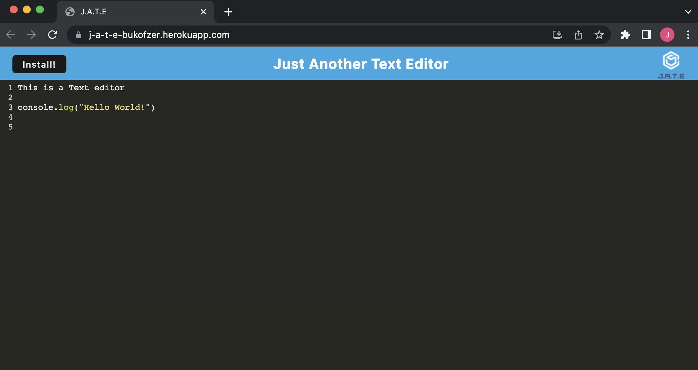

# Just Another Text Editor

## Description

A simple text editor app that is functional online and offline, that saves data so your work is not lost. This text editor uses methods for getting and storing data to an INdexDB database. This app can also be installed as a desktop app to be used offline.

## Deployed App Link

https://j-a-t-e-bukofzer.herokuapp.com/

  ## Table of Contents

  - [Installation](#installation)
  - [Usage](#usage)
  - [License](#license)
  - [Questions](#questions)
 
## Screenshot of App

## Installation

  To install, just click the install button in the top left to add this app to your device.

## Usage 

  Use just like any other text editor, and get to programming!

## License

  

## Questions
   - [GitHub:JeremyBukofzer](https://github.com/JeremyBukofzer)
   - [Email](jlbukofzer@gmail.com)

